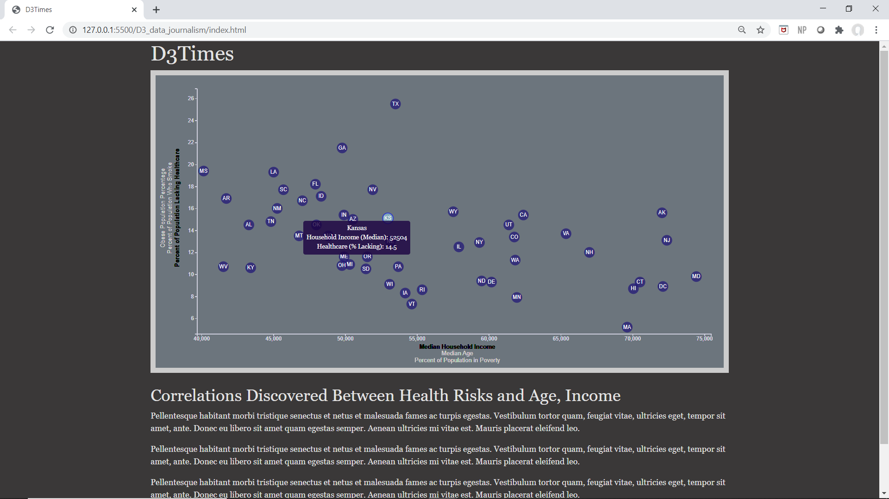

# D3-challenge

[Census Demographics Webpage](https://carleeyoung.github.io/D3-challenge/D3_data_journalism/)

2016 Census demographics were charted to show relationships between median household income, age, and poverty with healthcare, smoking and obesity for each state.  D3 coding was used to
create a dynamic chart to compare select parameters.  A tooltip was added to show detailed
information on each datapoint as you hover over the point.

